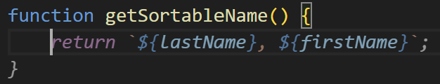
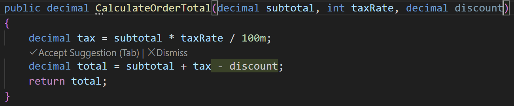
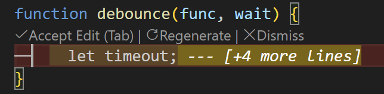

# Dorsal

**Local-first, inline AI coding for VS Code — think GitHub Copilot, but private and powered by your own models.**

Dorsal is a lightweight, in-flow code assistant that lives in VS Code. It works locally first via [llama.cpp](https://github.com/ggml-org/llama.cpp) REST APIs, so your code stays on your machine. This is not a full coding agent — just fast, inline assistance that gets out of the way.

---

## What You Can Do

### Tab Completions

Start typing and get ghost-text suggestions right where your cursor is.

### Next Edit Suggestions

After you make a change, Dorsal spots patterns and suggests what you might want to edit next — elsewhere in the same file. Accept with `Tab`, dismiss with `Escape`.

### Inline Quick Edits

Press `Ctrl+I`, and describe what you want. An agent will make the update at your selection or near your cursor.

---

## Getting Started

Open the setting page by clicking the fish icon and select settings to get started.

Set the server URL, API key, and model in VS Code settings (`dorsal.llmServer.baseUrl`)

Enable each feature individually in settings and start using the built-in commands and keybindings.

---

## Commands & Keybindings

| Command | Keybinding | Description |
|---|---|---|
| **Dorsal: Suggest Next Edit** | — | Manually request a next-edit suggestion |
| **Dorsal: Accept Next Edit Suggestion** | `Tab` | Accept the current suggestion |
| **Dorsal: Dismiss Next Edit Suggestion** | `Escape` | Dismiss the current suggestion |
| **Dorsal: Edit with AI** | `Ctrl+I` | Open the inline edit prompt for the current selection, or near your cursor |
| **Dorsal: Quick Implement** | `Ctrl+Shift+I` | Run an edit at your cursor using a default prompt (e.g. "Implement this") |
| **Dorsal: Accept Inline Edit** | `Enter` | Accept the inline edit diff |
| **Dorsal: Regenerate Inline Edit** | `Ctrl+Enter` | Regenerate inline edit |
| **Dorsal: Cancel Inline Edit** | `Escape` | Cancel the inline edit |

---
